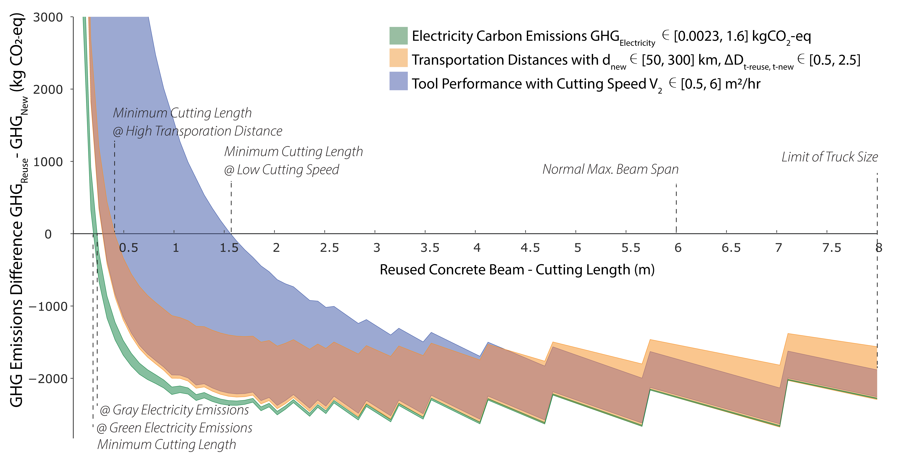

## Introduction

In our recent study, "Environmental savings from concrete reuse: examining the limitations and optimal practices for cutting thresholds of concrete building components for reuse," we tackle a crucial question in sustainable construction: How small can we cut concrete pieces while still saving greenhouse gas emissions?

## Key Findings

Our research yielded several important insights:

- We developed a mathematical model to investigate GHG emissions associated with preparing concrete for reuse.
- We established a screening standard for determining the minimum cutting size for concrete reuse.
- We found that the ratio of transportation distances (reuse case vs. new production) influences the minimum cutting size.
- We demonstrated that cutting size significantly impacts overall GHG emissions in the reuse strategy.

*(Differences in GHG emissions of concrete components with varying energy sources' GHG emissions, transportation distances and cutting tool performance)*

## Practical Implications

Our research offers practical insights for industry stakeholders to optimize concrete reuse practices and effectively reduce GHG emissions. We've also developed a tool prototype to guide professionals in optimizing cutting sizes for concrete reuse.

## Project Context

This study is part of the Circular Future Cities project, supported by:

- Future Cities Laboratory Global
- ETH Zurich
- HES-SO
- Federal Office of Energy (SFOE)
- HILTI AG

## Resources

- **Full paper:** [https://doi.org/10.1088/2634-4505/ad7a22](https://doi.org/10.1088/2634-4505/ad7a22)
- **Tool prototype:** [https://reuse-concrete.azurewebsites.net/](https://reuse-concrete.azurewebsites.net/)
- **GitHub:** [https://github.com/shuyanxiong/CFC_WP2](https://github.com/shuyanxiong/CFC_WP2)

## Conclusion

As further research explores cost-effectiveness and on-site case studies, concrete reuse emerges as a promising approach to sustainable construction, provided that minimum cutting dimensions are carefully considered.

## Contact

For more information or to discuss this research, please [contact me](xiong@ibi.baug.ethz.ch).