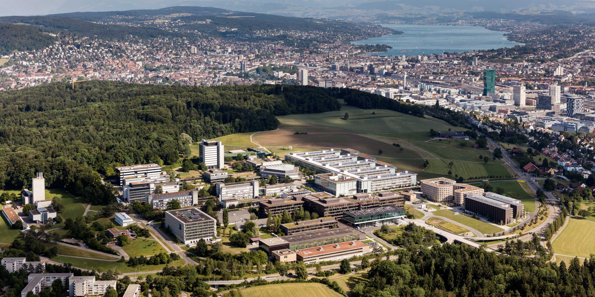

**Member of the Organising Committee – SBE25 Zurich**  
[Follow SBE25 on LinkedIn](https://www.linkedin.com/company/sbe-series)

**About SBE25 Zurich:**  
Sustainable Built Environment (SBE) 2025 Zurich is part of the globally recognized SBE conference series, providing a platform for leaders from academia, industry, and government to exchange knowledge and innovations for creating sustainable, resilient cities. The conference topic is “Shaping Tomorrow: Systems Thinking in the Built Environment”.

As a member of organizing committee and the hosting chair, I contribute to curating conference themes, managing conference contributions, details and communications to advance sustainable practices in the built environment.