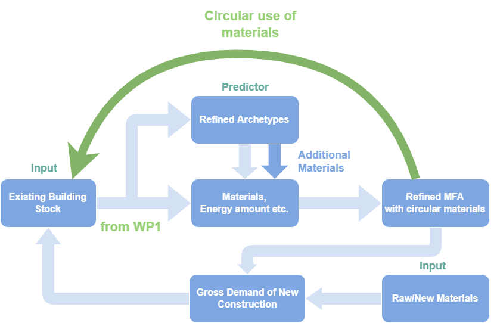

With construction accounting for nearly 50% of the world's annual resource consumption, the increasing demand for materials and the looming threat of climate change necessitate innovative solutions for sustainable urban development [^1^] [^2^] [^3^]. 

In response to these challenges, the Circular Economy (CE) concept emerges as a promising method, aiming to restore and regenerate products, components, and materials to maximize their utility and value [^4^]. Material Flow Analysis (MFA) serves as a crucial analytical methodology for realizing the concept, providing insights into material flows, stocks, and potential reuse, both spatially and temporally [^5^].

However, practical implementation in Swiss construction encounters challenges, notably the lack of digital information on buildings erected in the last century and unidirectional data flow [^6^] [^7^] [^8^] [^9^]. Additionally, components of building systems are often overlooked in the literature but could contribute significantly to building’s total carbon emissions [^10^] [^11^].

Acknowledging these data gaps, especially in older buildings, Machine Learning (ML) emerges as a potential tool for predictive modeling and data analysis [^12^] [^13^]. ML-based predictors, leveraging big data and automated methodologies, offer solutions to the scarcity of information on old buildings. Probabilistic models could then contribute to quantitative inclusion of data variability and uncertainty from assumptions when dealing with ambiguous cases [^3^] [^14^]. The predictive model is self-developed using parametric algorithms, which utilized key parameters from the database and followed the design principles of building systems. 

The figure above illustrates the general workflow of work packages 1 and 2. In this process, primary material flows come from constructive materials, and supplementary materials from building systems are integrated to refine and enhance the precision of the MFA outcomes. The 3D-printed models on the sides serve as an intuitive visualization of the material flows in a three-dimensional format, allowing for a brief understanding of how a typical building can be segmented into different systems, and help identify the primary materials originating from each system, highlighting key components that have the potential for circularity.

In the end, the employed approaches result in the completion of a comprehensive local database, enriching the predictive model's resources. The developed model serves as a valuable tool that captures professional expertise digitally. Its ability to accurately predict missing data and estimate material flows, particularly for less-assessed components like HVAC systems, provides valuable information for enabling circular material use through recycling, reuse, and refurbishment flows. The model exhibits adaptability and potential as an open-source platform, customized to specific needs. Its emphasis on essential building system components allows for the integration of additional equipment. 

In short, it will support more informed decision-making regarding resource allocation, material procurement, and waste reduction strategies, which could be planned well ahead and potentially solves the problem of timeliness in demolition schedules, allowing for a more time- and cost-efficient solution for resource management. Ultimately, it contributes to the transition toward a sustainable and circular future in the construction sector.

### References:
[^1^]: R. H. Crawford, A. Stephan, and F. Prideaux, “EPiC: Introducing a database of hybrid environmental flow coefficients for construction materials,” IOP Conf. Ser. Earth Environ. Sci., vol. 588, no. 4, p. 042052, Nov. 2020, doi: 10.1088/1755-1315/588/4/042052.
[^2^]: I. Hamilton, “Global Alliance for Buildings and Construction (GlobalABC),” p. 20.
[^3^]: N. Heeren and T. Fishman, “A database seed for a community-driven material intensity research platform,” Sci. Data, vol. 6, no. 1, pp. 1–10, 2019, doi: 10.1038/s41597-019-0021-x.
[^4^]: ARUP, “The Circular Economy in the Built Environment,” California Acad. Sci. San Franc. USA, pp. 1–93, 2016.
[^5^]: N. Heeren and S. Hellweg, “Tracking Construction Material over Space and Time: Prospective and Geo-referenced Modeling of Building Stocks and Construction Material Flows,” J. Ind. Ecol., vol. 23, no. 1, pp. 253–267, 2019, doi: 10.1111/jiec.12739.
[^6^]: D. Tavakoli, M. Hashempour, A. Heidari, and others, “Use of waste materials in concrete: A review,” Pertanika J Sci Technol, vol. 26, no. 2, pp. 499–522, 2018.
[^7^]: P. G. Quedou, E. Wirquin, and C. Bokhoree, “A sustainable approach in using construction and demolition waste materials in concrete,” World J. Eng., vol. 18, no. 6, pp. 826–840, 2021.
[^8^]: A. Teara, D. S. Ing, and V. W. Tam, “The use of waste materials for concrete production in construction applications,” in IOP Conference Series: Materials Science and Engineering, IOP Publishing, 2018, p. 012062.
[^9^]: E. K. Momanyi, “Reusing Waste Foundry Sand as Fine Aggregate in Concrete for Paving Blocks,” PhD Thesis, JKUAT-PAUSTI, 2018.
[^10^]: C. Kiamili, A. Hollberg, and G. Habert, “Detailed assessment of embodied carbon of HVAC systems for a new office building based on BIM,” Sustain. Switz., vol. 12, no. 8, 2020, doi: 10.3390/SU12083372.
[^11^]: E. Hoxha, D. Maierhofer, M. R. M. Saade, and A. Passer, “Influence of technical and electrical equipment in life cycle assessments of buildings: case of a laboratory and research building,” Int. J. Life Cycle Assess., vol. 26, no. 5, pp. 852–863, 2021, doi: 10.1007/s11367-021-01919-9.
[^12^]: A. Froemelt, R. Buffat, and S. Hellweg, “Machine learning based modeling of households: A regionalized bottom-up approach to investigate consumption-induced environmental impacts,” J. Ind. Ecol., vol. 24, no. 3, pp. 639–652, 2020, doi: 10.1111/jiec.12969.
[^13^]: K. P. Murphy, Machine learning: a probabilistic perspective. Cambridge, MA, 2012.
[^14^]: Z. Liu and B. Nowack, “Probabilistic material flow analysis and emissions modeling for five commodity plastics (PUR, ABS, PA, PC, and PMMA) as macroplastics and microplastics✰,” Resour. Conserv. Recycl., vol. 179, no. October 2021, p. 106071, 2022, doi: 10.1016/j.resconrec.2021.106071.