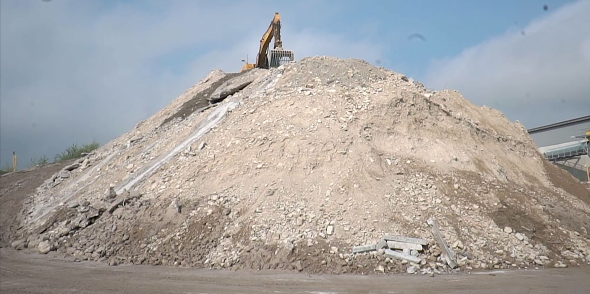

When envisioning the future of architecture, we tend to gravitate towards innovative technologies, new materials and advanced methods. However, there is also a powerful natural material embedded in our modern advances: earth.

Historically, earthen materials have been at the heart of human shelter. From our earliest dwellings to grand earthen structures, it is perhaps the oldest building technique in the world. However, with the rise of modern urban architecture, materials such as concrete, steel, wood and brick have overtaken earth. This raises a crucial question: why do we dig up earth only to discard it and replace it with energy-intensive materials?

*(Image: Chair for Sustainable Construction / ETH Zurich) [^1]*

The sustainable attributes of earth are manifold:

- **Cost-effectiveness and resource conservation:** Using excavated materials for construction breaks the cycle of mining and transportation of materials such as sand and gravel. This not only saves costs, but also protects our depleting natural resources.

- **Natural climate regulation:** Earthen buildings have an innate ability to regulate indoor humidity. The Triemli Hospital in Zurich, for example, utilizes earthen plaster in combination with modern building systems to achieve a balanced indoor environment.

- **Meeting modern challenges:** The depletion of high-quality sand from rivers and lakes poses a major threat to the construction industry. However, there is still a great deal of earth available where buildings rise up from the ground.

However, challenges remain. Traditional earthen construction techniques must evolve with the times to meet the requirements of modern buildings. This has prompted researchers around the world to work on improving the performance of earthen materials. From developing slurries with superior moisture-regulating properties to creating liquid soils that perform similarly to traditional concrete, researchers have made various efforts in this regard.

As we find ourselves at the intersection of modernization and sustainability, a compelling avenue emerges as we re-evaluate and innovate with clay. The Regenerative Laboratory of the Chair of Sustainable Construction at ETH Zurich has delved into a variety of techniques to explore the potential of clay materials. From experimenting with casting techniques with a variety of additives to studying rammed earth with different aggregate compositions, our efforts aim to achieve various goals, such as enhancing water resistance through tannins, speeding up production through pouring, or increasing strength through geopolymers. Presented here are some samples of earth bricks designed to illustrate their marketable solutions in the construction industry.

## Spotlight on the Samples:

- **Marketability:** 
Not only are these earth bricks produced by pouring techniques, but they also utilize a concrete-like production process, the material can be poured into molds similar to those used for traditional concrete, which offers the advantages of easy production, quick implementation, and fast construction. This not only meets market demand but also significantly reduces construction costs. In addition to these advantages, they are also environmentally friendly. The technique involves utilizing a small amount of inorganic additives, which enables excavated soil to flow with a lower amount of water and to set with the evolving time.

- **Versatility:** 
Clay mixtures are customizable, and different pigments can be added to match your design preferences. The porous structure and hydrophilic nature of clay give it excellent moisture-regulating properties, allowing for uses beyond building structural materials. This adaptable material helps to naturally regulate the indoor climate.

These samples showcase the immense potential of earth as a construction material. By combining traditional knowledge with modern techniques, we pave the way for more sustainable and eco-friendly building solutions.

For those interested in the vast potential of earthen construction, embracing and promoting these techniques may pave the way for a greener, more sustainable built landscape. Feel free to check our website and reach out at [https://sc.ibi.ethz.ch/en/](https://sc.ibi.ethz.ch/en/).

## References:

[1] “Building with excavated material.” Accessed: Oct. 05, 2023. [Online]. Available: [https://ethz.ch/en/news-and-events/eth-news/news/2017/10/building-with-excavated-material.html](https://ethz.ch/en/news-and-events/eth-news/news/2017/10/building-with-excavated-material.html)

[2] Y. Du, G. Habert, and C. Brumaud, “Design of Tannin-Based Poured Earth Material via Deflocculation–Coagulation Control: Additive Selection and Tannin Variation,” ACS Sustain. Chem. Eng., vol. 10, no. 44, pp. 14495–14502, Nov. 2022, doi: 10.1021/acssuschemeng.2c04078.

[3] D. Ardant, C. Brumaud, and G. Habert, “Influence of additives on poured earth strength development,” Mater. Struct., vol. 53, no. 5, p. 127, Oct. 2020, doi: 10.1617/s11527-020-01564-y.

[4] G. Landrou, C. Brumaud, and G. Habert, “Influence of magnesium on deflocculated kaolinite suspension: Mechanism and kinetic control,” Colloids Surf. Physicochem. Eng. Asp., vol. 544, pp. 196–204, May 2018, doi: 10.1016/j.colsurfa.2017.12.040.

[5] C. M. Ouellet-Plamondon and G. Habert, “Self-Compacted Clay based Concrete (SCCC): proof-of-concept,” J. Clean. Prod., vol. 117, pp. 160–168, Mar. 2016, doi: 10.1016/j.jclepro.2015.12.048.

[6] N. P. Martins, B. Çiçek, C. Brumaud, R. Snellings, and G. Habert, “Beyond efficiency: Engineering a sustainable low-tech cementitious binder for earth-based