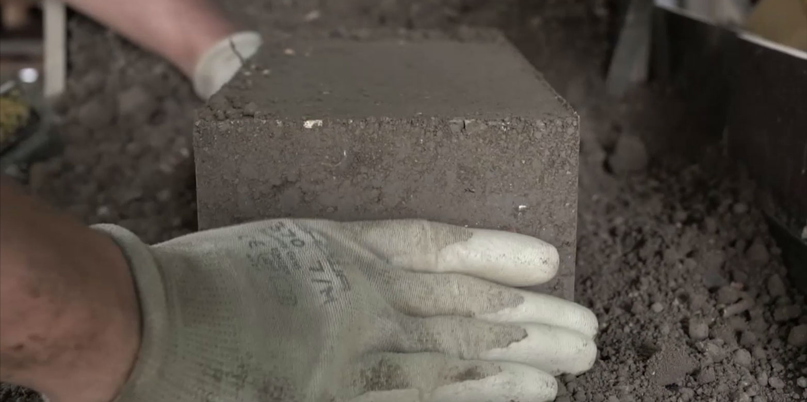

When envisioning the future of architecture, we tend to gravitate towards innovative technologies, new materials and advanced methods. However, there is also a powerful natural material embedded in our modern advances: earth.

Historically, earthen materials have been at the heart of human shelter. From our earliest dwellings to grand earthen structures, it is perhaps the oldest building technique in the world. However, with the rise of modern urban architecture, materials such as concrete, steel, wood and brick have overtaken earth. This raises a crucial question: why do we dig up earth only to discard it and replace it with energy-intensive materials?

*(Image: Chair for Sustainable Construction / ETH Zurich) [^1]*

The sustainable attributes of earth are manifold:

- **Cost-effectiveness and resource conservation:** Using excavated materials for construction breaks the cycle of mining and transportation of materials such as sand and gravel. This not only saves costs, but also protects our depleting natural resources.

- **Natural climate regulation:** Earthen buildings have an innate ability to regulate indoor humidity. The Triemli Hospital in Zurich, for example, utilizes earthen plaster in combination with modern building systems to achieve a balanced indoor environment.

- **Meeting modern challenges:** The depletion of high-quality sand from rivers and lakes poses a major threat to the construction industry. However, there is still a great deal of earth available where buildings rise up from the ground.

However, challenges remain. Traditional earthen construction techniques must evolve with the times to meet the requirements of modern buildings. This has prompted researchers around the world to work on improving the performance of earthen materials. From developing slurries with superior moisture-regulating properties to creating liquid soils that perform similarly to traditional concrete, researchers have made various efforts in this regard.

As we stand at the crossroads of modernization and sustainability, revisiting and innovating with clay offers a promising path forward. The Regenerative Lab at the Chair of Sustainable Construction, ETH Zurich, has presented earthen material samples on display.

## Spotlight on the Samples:

- **Stability:** These bricks, resembling conventional ones, have the added advantage of being environmentally friendly. The technique involves using the inorganic part of excavated soil, compressing it, and stabilizing it with small quantities of cement or lime.

- **Versatility:** mixing different clays enhances its moisture regulating properties. It can be used not only as constructive materials, but also to naturally regulate the indoor climate.

- **Flexibility:** this material can be poured into molds like traditional concrete, revolutionizing the application process and significantly reducing construction costs. This earthy material can also be adapted for 3D printing, design flexibility and light weight, reducing labor-intensive work.

These samples showcase the immense potential of earth as a construction material. By combining traditional knowledge with modern techniques, we pave the way for more sustainable and eco-friendly building solutions.

For those interested in the vast potential of earthen construction, embracing and promoting these techniques may pave the way for a greener, more sustainable built landscape. Feel free to check our website and reach out at [ETH Zurich Sustainable Construction](https://sc.ibi.ethz.ch/en/).

## References:

[^1]: [“Building with excavated material.”](https://ethz.ch/en/news-and-events/eth-news/news/2017/10/building-with-excavated-material.html) Accessed: Oct. 05, 2023.
